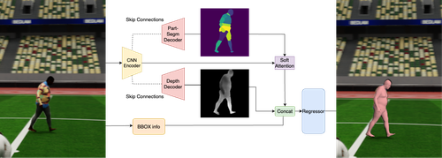

<div align="center">

# D-PoSE: Depth as an Intermediate Representation for 3D Human Pose and Shape Estimation
## [Pre-Print](https://arxiv.org/abs/2410.04889)

## Install
**Docker** installed and properly configured
**NVIDIA Container Toolkit** installed
   - `CUDA GPU required`
**D-PoSE model files**:
   - `data/ckpt/paper_arxiv.ckpt`
   -  [Google Drive link ](https://drive.google.com/file/d/1j1ruKg4Wvul8eGMM3KjDkrcjWTFXk6yN/view?usp=sharing)
**Register for SMPL and SMPLX body models (READ LICENSE)**:
   - `https://smpl.is.tue.mpg.de/`
   - `https://smpl-x.is.tue.mpg.de/`
```
docker build -t dpose .
docker compose -p dpose-0 up -d
docker exec -it dpose-0 bash
pip install git+https://github.com/nikosvasilik/neural_renderer
cd dpose
```


### D-PoSE demo

```
 python3 demo.py --cfg configs/dpose_conf.yaml

```


## Evaluation
Checkpoint and more instructions coming soon.
Default dataset for evauluation is 3DPW.
Change dpose_conf.yaml VAL_DS value to change the testing dataset.
```
 python3 train.py --cfg configs/dpose_conf.yaml --ckpt data/ckpt/paper.ckpt --test

```

## Training
```
 python3 train.py --cfg configs/dpose_conf.yaml
```

## Qualitative Results

# Citation
```
@article{vasilikopoulos2024d,
  title={D-PoSE: Depth as an Intermediate Representation for 3D Human Pose and Shape Estimation},
  author={Vasilikopoulos, Nikolaos and Drosakis, Drosakis and Argyros, Antonis},
  journal={arXiv preprint arXiv:2410.04889},
  year={2024}
}
```


# References
We benefit from many great resources including but not limited to [BEDLAM](https://github.com/pixelite1201/BEDLAM),[SMPL-X](https://smpl-x.is.tue.mpg.de/),[TokenHMR](https://github.com/saidwivedi/TokenHMR),[SMPL](https://smpl.is.tue.mpg.de), [PARE](https://gitlab.tuebingen.mpg.de/mkocabas/projects/-/tree/master/pare),[ReFit](https://github.com/yufu-wang/ReFit) ,[CLIFF](https://github.com/huawei-noah/noah-research/tree/master/CLIFF), [AGORA](https://agora.is.tue.mpg.de), [PIXIE](https://pixie.is.tue.mpg.de), [HRNet](https://github.com/leoxiaobin/deep-high-resolution-net.pytorch).


